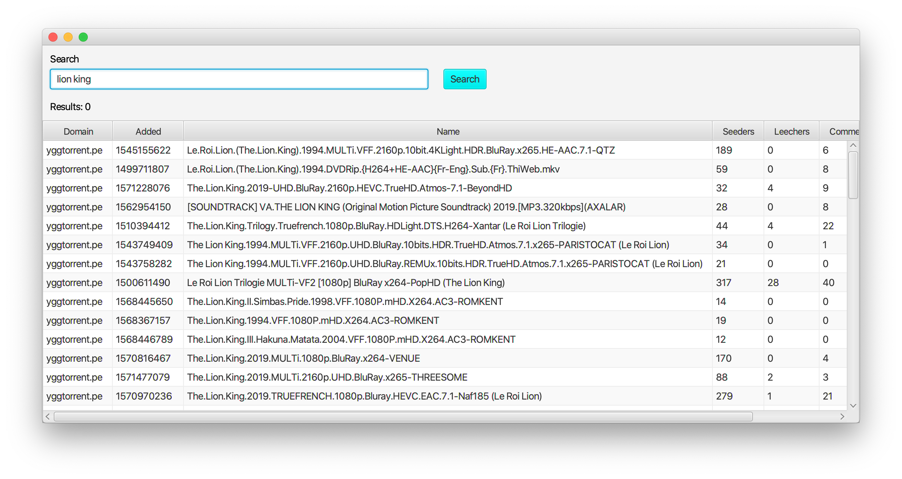

# Torrent Search Engine

This project helps me to learn / improve differents things.
With it, I practice Kotlin, and I discover TornadoFX, Couroutines, HTTP concepts, Unit Tests, ...

The main goal of this application will be to access torrent data from a software GUI.

Multiple features will be implemented.

## How to start application

- Download latest release : <https://github.com/remylavergne/TorrentSearchEngine/releases/tag/0.2>
- You have to use JDK 8 max (<https://www.oracle.com/technetwork/java/javase/downloads/jdk8-downloads-2133151.html>)
- Start application

```terminal
java -jar torrent-search-engine-0.2-all.jar
```

## Screenshots


